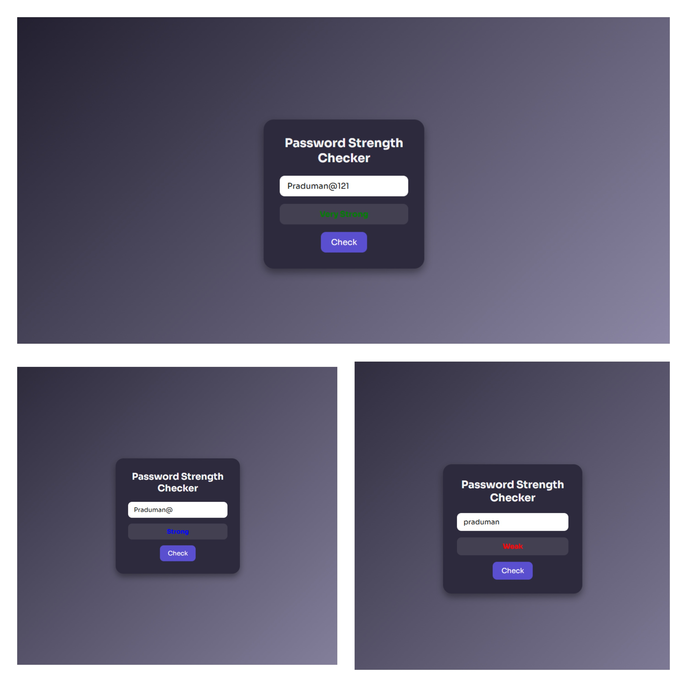

# 🔐 Password Strength Checker

A simple and interactive password strength checker built with **HTML, CSS, and JavaScript**. It provides real-time feedback on the strength of your password based on several criteria including special characters, numbers, uppercase & lowercase letters, and length.

---


---

## 🖼️ Project Preview

Here’s a quick look at the UI in action:



---

## 💡 Features

- ✅ Real-time strength evaluation
- ✅ Checks for:
  - Special characters (`!@#$%...`)
  - Numbers (`0-9`)
  - Uppercase letters (`A-Z`)
  - Lowercase letters (`a-z`)
  - Minimum password length
- ✅ Dynamic color feedback (Weak, Medium, Strong, Very Strong)
- ✅ Responsive and modern UI design

---

## 📦 Tech Stack

- HTML5
- CSS3 (custom styling with gradients & glow effects)
- JavaScript (Vanilla)

---

## 🧠 How It Works

The logic checks for the presence of:
- **Special Characters**
- **Numbers**
- **Uppercase Letters**
- **Lowercase Letters**

Each satisfied condition increases the strength level:
- 🔴 Weak = only 1 criteria
- 🟠 Medium = 2 criteria
- 🔵 Strong = 3 criteria
- 🟢 Very Strong = all 4 criteria

---


## 💻 Setup & Run Locally

```bash
git clone https://github.com/C-W-Praduman/Password-strength-checker.git
cd password-strength-checker
open index.html
